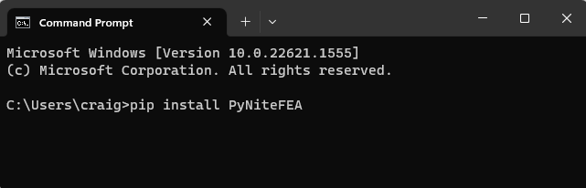

============
Installation
============

`Pynite` can be installed via `pip` (Python's default package installer). Run the following command from the command line interface:

.. code-block:: console

    $ pip install PyniteFEA

Be sure to install ``PyniteFEA`` rather than ``Pynite``. The second one is a different package that
has nothing to do with finite element analysis.

For engineers who may be new to `python`, the ``$`` symbol in the line above represents any directory in your system that ``pip`` is accessible from. If you checked the box to place `python` on your system ``PATH`` during installation (recommended) you can run ``pip`` from any directory (see image below). Otherwise it's sitting in the ``Scripts`` folder in the directory where Python was installed, and you'll need to either add it to your system ``PATH`` or navigate to that directory via the console and run the ``pip`` command above.

To get the most out of `Pynite` you can use the following commands to install a few more optional dependences. A list of what each of these dependencies does for `Pynite` can be found below:

.. code-block:: console

    $ pip install matplotlib
    $ pip install scipy
    $ pip install pdfkit
    $ pip install jinja2
    $ pip install pyvista

It is recommended to at least install `scipy` if you choose not to install all the optional dependencies. This will allow you to still use the sparse matrix solver which is usually faster and uses less memory. By default `Pynite` uses the sparse solver, so if you don't install `scipy` you'll need to pass the parameter ``sparse=False`` to the solver when you go to analyze, otherwise the program will throw an exception.

If you plan to use Pynite in `Jupyter` notebooks it is recommended to run the following commands instead of the last line of the previous set of commands.

.. code-block:: console

    $ pip install pyvista[all,trame]
    $ pip install ipywidgets
    $ pip install trame_jupyter_extension

`Jupyter` can be installed using the following command. Note that in order to install the `trame` libraries you'll need to install `Jupyter` first if you haven't already.

.. code-block:: console

    $ pip install jupyterlab

After installing `Jupyter` you'll be able to view some of the documents used to help derive `Pynite` if you also install `sympy`. You'll find these documents in the installation directory. `sympy` can be installed as follows:

.. code-block:: console
    
    $ pip install sympy

Dependencies
============

`Pynite` depends on the following packages:

Required Dependencies
---------------------

* `numpy`: Used for matrix algebra and dense matrix solver
* `PrettyTable`: Used to format tabular output

Optional Dependencies
---------------------

* `scipy`: Used for sparse matrix solver to improve solution speed and memory management. In most cases you'll want to install scipy. It is highly recommended for large models.
* `matplotlib`: used for plotting member diagrams.
* `PDFKit`: Used for generating pdf reports. In order to generate pdf reports, PDFKit requires you to have wkhtmltopdf installed on your computer. This is a free program available for download at https://wkhtmltopdf.org/downloads.html. Once installed, you'll need to help PyNite find it. On Windows, this can be done by setting your PATH environment variable to include the path to "wkhtmltopdf.exe" after installation. For example, mine is installed at "C:\Program Files\wkhtmltopdf\bin"
* `jinja2`: Used by `Pynite` for templating reports into HTML prior to HTML-to-pdf conversion. Only needed if you plan to use the PDF reporting features.
* jupyterlab: Only needed if you want to view the derivations used to build PyNite.
* sympy: Only needed if you want to view the derivations used to build PyNite.
* `pyvista`: Used for visualization.
* `pyvista[all, trame]`: Used for interactive visualization in `Jupyter` notebooks.
* `ipywidgets`: Used for interactive visualization in `Jupyter` notebooks.
* `trame_jupyter_extension`: Used for interactive visualization in `Jupyter` notebooks.
* `VTK`: (Legacy) used for visualization - Note that VTK is a little picky about which version of Python you are running. You must run a 64 bit installation of Python, rather than a 32 bit version. VTK is published by Kitware. I've noticed Kitware takes a little time updating VTK to be compatible anytime a new version of Python is released. If you're having trouble installing VTK, you can see which versions of Python are supported by visiting https://pypi.org/project/vtk/#files. VTK does not need to be installed if you don't plan to use the visualization tools built into PyNite.