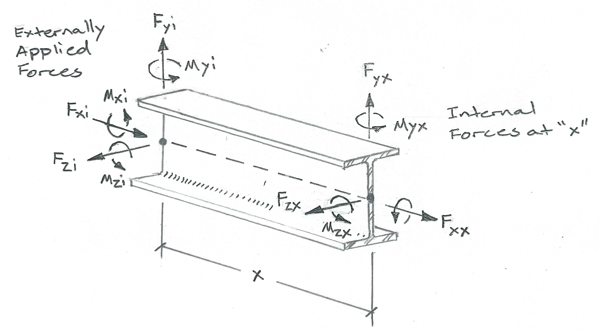

=======
Members
=======

All members in Pynite are beam-column elements, meaning they can handle axial and transverse loads.
By default all members are also "physical members", meaning they automatically segment themselves
at any internal nodes. Transverse shear deformations are not currently considered.

Creating a New Member
=====================

To create a new member use the ``FEModel3D.add_member()`` method. First we'll set up some
material and section properties:

.. code-block:: python

    # Define a few section properties (W12x26)
    Iy = 17.3  # (in**4) Weak axis moment of inertia
    Iz = 204   # (in**4) Strong axis moment of inertia
    J = 0.300  # (in**4) Torsional constant
    A = 7.65   # (in**2) Cross-sectional area

    # Define a new material (steel)
    E = 29000  # (ksi) Modulus of elasticity
    G = 11400  # (ksi) Shear modulus
    nu = 0.30  # Poisson's ratio
    rho = 0.000283  # (kci) Density
    my_model.add_material('Steel', E, G, nu, rho)

    # Add a member name 'M1' starting at node 'N1' and ending at node 'N2'
    # made from a previously defined material named 'Steel'
    my_model.add_member('M1', 'N1', 'N2', 'Steel', Iy, Iz, J, A)

Local Coordinate System
=======================

Each member starts at its i-node and ends at its j-node. The local x-axis for the member is defined
by a vector going from the i-node to the j-node.

By default the local z-axis is always horizontal in Pynite, and is on the right-hand side of the
member.

The local y-axis is defined as the cross-product of the local z-axis with the local x-axis. In
other words, the local y-axis is always perpendicular to the member and to the local z-axis.

Positive sign conventions are shown below.

End Releases
============

End releases can be applied to each end of a member to simulate pinned connections or other end conditions. End releases can be applied using the ``FEmodel3D.def_release()`` method. See below for an example. By applying rotational end releases to both ends of a member you can simulate two-way truss members.

.. code-block:: python

    # The following line turns member M1 into a pin-ended member
    my_model.def_release('M1', Dxi=False, Dyi=False, Dzi=False, Rxi=False, Ryi=True, Rzi=True, Dxj=False, Dyj=False, Dzj=False, Rxj=False, Ryj=True, Rzj=True)

    # This next line does the same thing as the previous line - just simplified
    my_model.def_release('M1', False, False, False, False, True, True, False, False, False, False, True, True)

    # This next line is yet another simple way to do the same thing
    my_model.def_release('M1', 0, 0, 0, 0, 1, 1, 0, 0, 0, 0, 1, 1)

Note that in the code above, ``Dxi`` stands for displacement in the local x direction at the
i-node, ``Rjz`` stands for rotation about the local z axis at the j-node, and so forth.

In most cases you will only release the rotations about the local y and/or z-axes. Releasing torsion
about the local x-axis should only be done at one end (if at all). The same goes for axial releases.
Releasing Rxi and Rxj simultaneously, or Dxi and Dxj simultaneously will cause an instability in the
member. You should exercise caution when releasing the shears at the ends of the member too.

Tension/Compression Only Members
================================

Members can be changed to tension or compression only by passing ``tension_only=True`` or
``comp_only=True`` to the ``FEModel3D.add_member()`` method. Here's an example:

.. code-block:: python

    my_model.add_member('M1', 'N1', 'N2', 'Steel', Iy, Iz, J, A, tension-only=True)
    my_model.add_member('M2', 'N1', 'N2', 'Steel', Iy, Iz, J, A, comp-only=True)

Tension-only and compression-only analysis is an iterative process. When using these types of
members be sure to perform a non-linear analysis. Do not use the ``FEModel3D.analyze_linear()``
method.

Member loads
============

Pynite supports member distributed loads and member point loads. It can also calculate self-weight for members (note that self-weight is not supported for plate elements at this time). Distributed loads can be full length or partial length, and can vary linearly in magnitude. Loads can be applied in member local (`'Fx'`, `'Fy'`, `'Fz'`, `'Mx'`, `'My'`, `'Mz'`) or model global coordinate directions (`'FX'`, `'FY'`, `'FZ'`, `'MX'`, `'MY'`, `'MZ'`).

Member Results
==============

Once your model is solved you can access members and their results from the ``Members`` dictionary in the ``FEModel3D`` class. Below are some examples.

Shear Results:

.. code-block:: python

    # Get the maximum strong-axis shear from member 'M1' for load combination '1.4D'
    my_model.Members['M1'].max_shear('Fy', '1.4D')

    # Get the minimum weak-axis shear from member 'M3' for load combination '1.2D+1.6L'
    my_model.Members['M3'].min_shear('Fz', '1.2D+1.6L')

    # Get the strong axis shear 5 units from the start of member 'M2' for load combination '1.2D+1.6S'
    my_model.Members['M2'].shear('Fy', 5, '1.2D+1.6S')

    # Plot the strong axis shear diagram for member 'M1' for load combination '1.4D' using 100 points
    my_model.plot_shear('Fy', '1.4D', 100)

Moment Results:

.. code-block:: python

    # Get the maximum strong-axis moment from member 'M1' for load combination '1.4D'
    my_model.Members['M1'].max_moment('Mz', '1.4D')

    # Get the minimum weak-axis moment from member 'M3' for load combination '1.2D+1.6L'
    my_model.Members['M3'].min_moment('My', '1.2D+1.6L')

    # Get the strong axis moment 5 units from the start of member 'M2' for load combination '1.2D+1.6S'
    my_model.Members['M2'].moment('Mz', 5, '1.2D+1.6S')

    # Plot the strong axis moment diagram for member 'M1' for load combination '1.4D' using 100 points
    my_model.plot_moment('Mz', '1.4D', 100)

Deflection Results:

.. code-block:: python

    # Get the maximum strong-axis deflection from member 'M1' for load combination 'D'
    my_model.Members['M1'].max_deflection('dy', 'D')

    # Get the minimum weak-axis deflection from member 'M3' for load combination 'D+L'
    my_model.Members['M3'].min_deflection('dz', 'D+L')

    # Get the strong axis defletion 5 units from the start of member 'M2' for load combination 'D+S'
    my_model.Members['M2'].deflection('dy', 5, 'D+S')

    # Plot the strong axis deflection diagram for member 'M1' for load combination 'D' using 100 points
    my_model.plot_deflection('dy', 'D', 100)

Similar methods can be used to obtain results for axial forces and torques.
